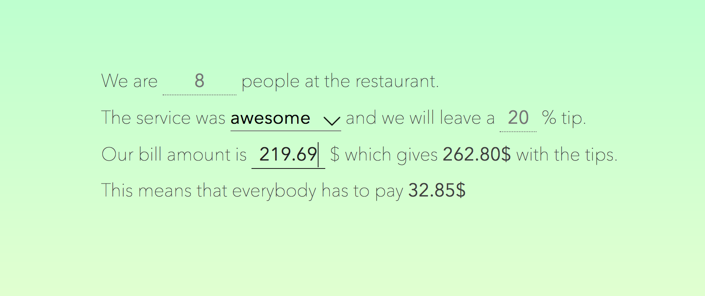

# Zaraina

> Split the bill

**Visit [zaraina.rafanilo.com](https://zaraina.rafanilo.com).**

Zaraina is a very simple PWA that tells you how much does everybody has to pay at the restaurant. The calculation is based on the service you had (which influences the tips you give) and how many people are in the group.

## Why?

I just wanted to make some thing simple to experiment with:

- TypeScript
- Cycle.JS
  - Cycle-Onionify
- PWA's

**Conclusion**: I really like Cycle.js and would like to create more projects with it. :-).

## How?

The project was generated with create-cycle-app using the cycle-ts-simple flavor. 

The stylesheets are written in less.

## Quick start

1. Clone the repo.
2. Inside of the folder, run `npm install`.
3. Run `npm start`.
4. Open your browser at `http://localhost:8000`.